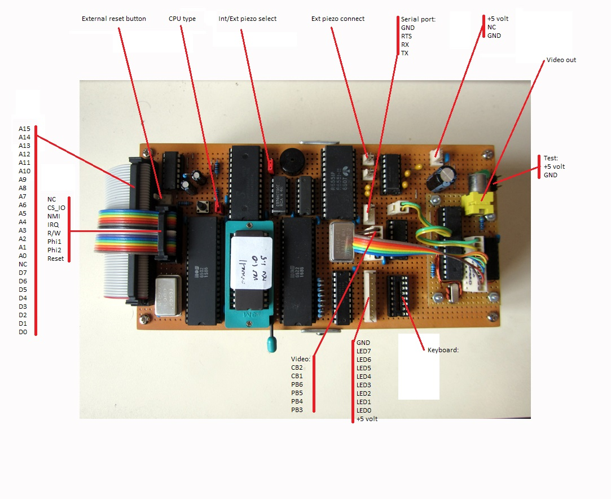
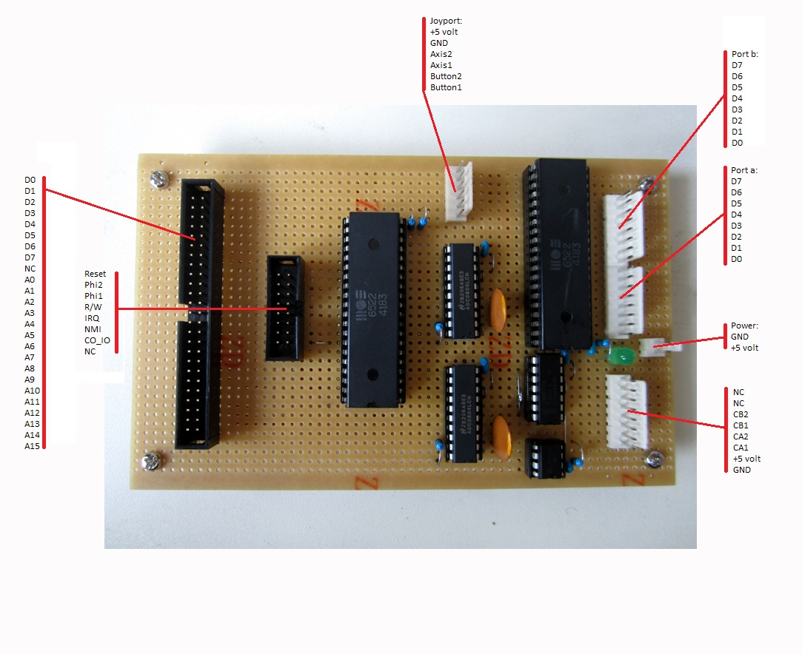

# Orwell 6502 Computer

This is the source code used in my Orwell 6502 computer project. This is a home made 6502 computer made to my own design running a fairly generic flavoue of 1980s BASIC.

The original project is described here: [Orwell Computer](https://web.archive.org/web/20190803190500/http://www.asciimation.co.nz/bb/category/6502-computer)

A YouTube film of the watch is available here: [Orwell Computer in a case](https://www.youtube.com/watch?v=IEpi9B4yk_s)

This IS NOT a running project. It requires very custom, one-off hardware and uses external libraries not included here. This code is provided purely for interested parties to examine.

The code is 6502 assembler and is a modified version of the original version OSI BASIC. I added extra routines specific to my computer. 

The code is assembled using the [CA65 Assembler](https://www.cc65.org/doc/ca65.html)

## Documentation

This post is to start documenting how my Orwell machine works. I'll update it as things change.

#### Overview

Orwell is a home made 6502 based machine. It has 16K of RAM, 32K of ROM and a 6522 VIA and a 6551 ACIA for IO as well as an additional 8 bit writable latch with debugging LEDs attached. Video output is via Grant Searle's ATMega based video board. An additional IO daughter board provides an analogue 2 axis joyport and extra IO capability (16 bits GPIO and 4 special). 

Text is in either 80x25, 40x25, 80x12, 40x12 modes. 
Graphics are 160 x 100.

#### Hardware

RAM is provided by a HM62256 32K SRAM with only the first 16K addressable. ROM is a 27C256 EPROM. 

The keyboard is an old surplus Ti99/4 keyboard which is scanned using the 6522 VIA. The same VIA also drives the video board. Simple sounds can produced by this VIA using the timer on PB7. Values are poked into the Timer 1 low and high latches directly.

The 6551 ACIA is used for serial communications running at 19200:8,N,1 with RTS/CTS hardware flow control.

The IO daughter board add two additional 6522 VIAs. One is set up to continuously read two ADC0804 analog to digital converters and provide push button support to allow an analog joystick to be connected. The push buttons are connected to the LSB of the ports (the LSB from the ADC is dropped). When pressed the value read from each ADC will be even. When not pressed the value from each ADC will be odd. This allows the user to performa  simple AND with 1 to check the button state. Losing the LSB doesn't affect the reading too much as the bottom bit is the one most affected by jitter. Losing that 1 bit of accuracy doesn't make much practical difference for a simple joystick control.

The daughter board also provides a power on reset function (using a simple 555 timer) to provide a clean reset on start up.

The second VIA is wired as a general purpose IO port providing 16 bits of general IO in two 8 bit ports (VIA port a and b). The 4 extra control signals (CA1,2 and CB1,2) are also routed to this port.

RAM is addressed from $0000 $3FFF, IO is from $4000 to $7FFF and ROM from $8000 to $FFFF.

#### The detailed memory map

```
$FFFF - $FFFE: ROM (IRQ)
$FFFD - $FFFC: ROM (Reset vector)
$FFFB - $FFFA: ROM (NMI)
$FFF0 - $8000: ROM (32K)
$6000: 8 bit latchable IO port (with LEDs)
$500F - $5000: 6522 VIA1 (keyboard and video)
$4803 - $4800: 6551 ACIA (serial comms)
$440F - $4400: 6522 VIA 2 (joystick port, 2 analog values and 2 buttons)
$420F - $4200: 6522 VIA3 (general IO port)
$3FFF - $0000: RAM (16K)
```

#### Software

Orwell is running a custom built version of Microsoft BASIC from 1978. I started with the Ohio Scientific code and have modified it to suit the Orwell hardware, adding commands as necessary. The keyboard and video control code is custom written. The start up routines have been simplified (terminal width and memory size questions removed).

#### Commands added

```
CLS: Clear the screen and position cursor home.
GET: Returns the currently pressed key or null (not empty string).
LOAD: Silent load from serial port.
MOVE: Move the cursor to the position indicated by x_val and y_val.
PLOT: Plot a point at the position indicated by x_val and y_val. Colour in c_val (0=black, 1=white).
LINE: Draw a line from the position indicated by x_val and y_val to a_val and b_val. Colour in c_val (0=black, 1=white).
RECT: Draw a rectangle from the left top corner position indicated by x_val and y_val to the right bottom position given by a_val and b_val. Colour in c_val (0=black, 1=white).
CIRCLE: Draw a circle centred on the position indicated by x_val and y_val with the radius given in a_val. Colour in c_val (0=black, 1=white).
SETCUR: Set the cursor to the value given in c_val (0=cursor off).
FONT: Change the display font to the value indicated in c_val.
```


#### PEEK AND POKE values

##### IO panel
```
LED IO port: POKE 24567, ?
```

##### Sound
```
Sound low register: POKE 20484, ?
Sound high register: POKE 20485, ?
```

##### General purpose
```
c_val: POKE 783, ?
x_val: POKE 784, ?
y_val: POKE 785, ?
a_val: POKE 786, ?
b_val: POKE 787, ?
```

##### Joyport (on VIA 2)
```
IO VIA 2 port b (axis b): PEEK 17408, ?
IO VIA 2 port a (axis a): PEEK 17409, ?
```
To check if buttons a and b check if value above is odd (button not pushed).

##### General IO port (on VIA 3)
```
IO VIA 3 port b: POKE/PEEK 16896, ?
IO VIA 3 port a: POKE/PEEK 16897, ?
IO VIA 3 ddr b (1 = output): POKE/PEEK 16898, ?
IO VIA 3 ddr a (1 = output): POKE/PEEK 16899, ?
IO VIA 3 t1cl (timer 1 low latch): POKE 16900, ?
IO VIA 3 t1ch (timer 1 high latch): POKE 16901, ?
```

#### Font and Graphics controls

Video output is using Grant Searle's video board as described here: http://searle.hostei.com/grant/MonitorKeyboard/index.html

The general purpose registered mentioned above are used for controlling text and graphics.

To change the font enter a value in the c val register then call FONT.

##### The value is a number controlling the text attributes
```
Bit 2 = double height
Bit 1 = bold
Bit 0 = 80 columns
```
##### The different combinations

```
40 Character normal = 0x000 = 0
80 Character normal = 0x001 = 1
40 Character bold = 0x010 = 2
80 Character bold = 0x011 = 3
40 Character normal double-height = 0x100 = 4
80 Character normal double-height = 0x101 = 5
40 Character bold double-height = 0x110 = 6
80 Character bold double-height = 0x111 = 7
```
The default startup value is 40 column bold double height (as this is best on small LCD screens). 

Standard ASCII is implemented for the main character set. Extended ASCII codes are implemented the same as for DOS. Control codes are standard ASCII where applicable - other codes added to allow control of the screen. The full implementation is shown below:

#### Video display control codes
```
Hex (Decimal) and meaning
01 (01) - Cursor home (Standard ASCII)
02 (02) - Define cursor character (2nd byte is the curs character, or 00 to turn off) <--New for 3.0
03 (03) - Cursor blinking
04 (04) - Cursor solid
05 (05) - Set graphics pixel (next two bytes = x,y) <--New for 3.0
06 (06) - Reset graphics pixel (next two bytes = x,y) <--New for 3.0
08 (08) - Backspace (Standard ASCII)
09 (09) - Tab (Standard ASCII)
0A (11) - Linefeed (Standard ASCII)
0C (12) - Clear screen (Standard ASCII)
0D (13) - Carriage return (Standard ASCII)
0E (14) - Set column 0 to 79 (2nd byte is the column number) or 0 to 39 for a 40 char line
0F (16) - Set row 0 to 24 (2nd byte is the row number)
10 (16) - Delete start of line
11 (17) - Delete to end of line
12 (18) - Delete to start of screen
13 (19) - Delete to end of screen
14 (20) - Scroll up
15 (21) - Scroll down
16 (22) - Scroll left
17 (23) - Scroll right
18 (24) - Set font attribute for the current line (see elsewhere on this page for details) <--New for 3.0
1A (26) - Treat next byte as a character (to allow PC DOS char codes 1 to 31 to be displayed on screen)
1B (27) - ESC - reserved for ANSI sequences
1C (28) - Cursor right
1D (29) - Cursor Left
1E (30) - Cursor up
1F (31) - Cursor down
20 (32) to 7E (126) - Standard ASCII codes
7F (127) - Delete
80 (128) to FF (255) - PC (DOS) extended characters
```

So, to print "Hello" at column 18, row 10 on the monitor in BASIC would be as follows:
```
PRINT CHR$(14) ; CHR$(17) ; CHR$(15) ; CHR$(9) ; "HELLO"
```

#### Character set
The character set is using the DOS character set (http://en.wikipedia.org/wiki/Code_page_437). Any printable character can be set as the cursor by putting it's decimal value into c_val and calling SETCUR.

### Specific code examples.

The following are some code snippets. These can be entered in direct mode or in BASIC code. The text after the ; is comments to make this easier to understand. This text isn't part of the command! Values for PEEK and POKE are in the range 0-255 since this is an 8 bit computer.

##### To clear the screen and home the cursor
```
CLS
```

##### To change the font display
```
POKE 783, 1    ;80 column, other values given above
FONT
```

##### To change the cursor
```
POKE 783, 2    ;2 = smiley face
SETCUR
```

##### To output to the LEDs
```
POKE 24576, ?
```

##### To make sounds
```
POKE 20484, ?
POKE 20485, ?
```

##### To stop the sound
```
POKE 20484, 0
POKE 20485, 0
```

##### To plot a point
```
POKE 783, 1    ;colour black
POKE 784, 10   ;x point
POKE 785, 10   ;y point
PLOT
```

##### To draw a line
```
POKE 783, 1    ;colour black
POKE 784, 10   ;x1 point
POKE 785, 10   ;y1 point
POKE 786, 50   ;x2 point
POKE 787, 50   ;y2 point
LINE
```

##### To draw a rectangle
```
POKE 783, 1    ;colour black
POKE 784, 10   ;x1 point
POKE 785, 10   ;y1 point
POKE 786, 50   ;x2 point
POKE 787, 50   ;y2 point
RECT
```

##### To draw a circle
```
POKE 783, 1    ;colour black
POKE 784, 45   ;x centre point
POKE 785, 45   ;y centre point
POKE 786, 25   ;radius
CIRCLE
```

##### To check for a key press
```
GET A$                      
IF LEN(A$) <> 0 THEN ...    ;If length is zero it means no key is being pressed.
```

##### To read the joyport (returns 0..255 odd or even values depending on button state)
```
X = PEEK (17409)    ;Axis 1 (port a on the VIA)
B = X AND 1         ;Check lowest bit
IF B = 0 THEN ...   ;0 = button pressed 1 = button not pressed
```

##### To read the joyport (returning a 0..127 continuous range)
```
X = PEEK (17409)    ;Axis 1 (port a on the VIA)
X1 = INT(X/2)       ;Convert to a 1..127 value with no gaps
```

##### To read the general IO ports as inputs
```
PEEK (16896)        ; Read port b
PEEK (16897)        ; Read port a
```

##### To change the general IO port to input or output (1 indicates output)
```
POKE 16898, 255     ;Port b ddr, all outputs
POKE 16898, 0       ;Port b ddr, all inputs
POKE 16899, 255     ;Port a ddr, all outputs
POKE 16899, 0       ;Port a ddr, all inputs
```

##### To change the general IO port a to be 0..4 input, 5..7 outputs
```
POKE 16899, 240     ;Port a ddr in binary 1111000
```

##### To set bits 5..7 above to on
```
POKE 16897, 240     ;Port a in binary 1111000
```

##### To set bits 5..7 above to off
```
POKE 16897, 0       ;Port a in binary 0000000
```

### Board layout






## Authors

* **Simon Jansen** - [Asciimation](http://www.asciimation.co.nz)

## License

This project is licensed under the MIT License - see the [LICENSE.md](LICENSE.md) file for details

## Acknowledgments

Thanks to the author and maintainers of [CA65](https://www.cc65.org/)

And to Grant Searle for his video/keyboard controller [Grant Searle](https://www.searle.wales)


